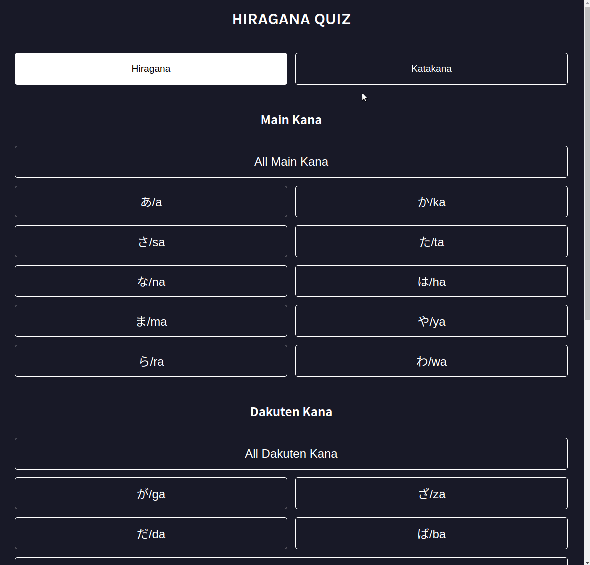
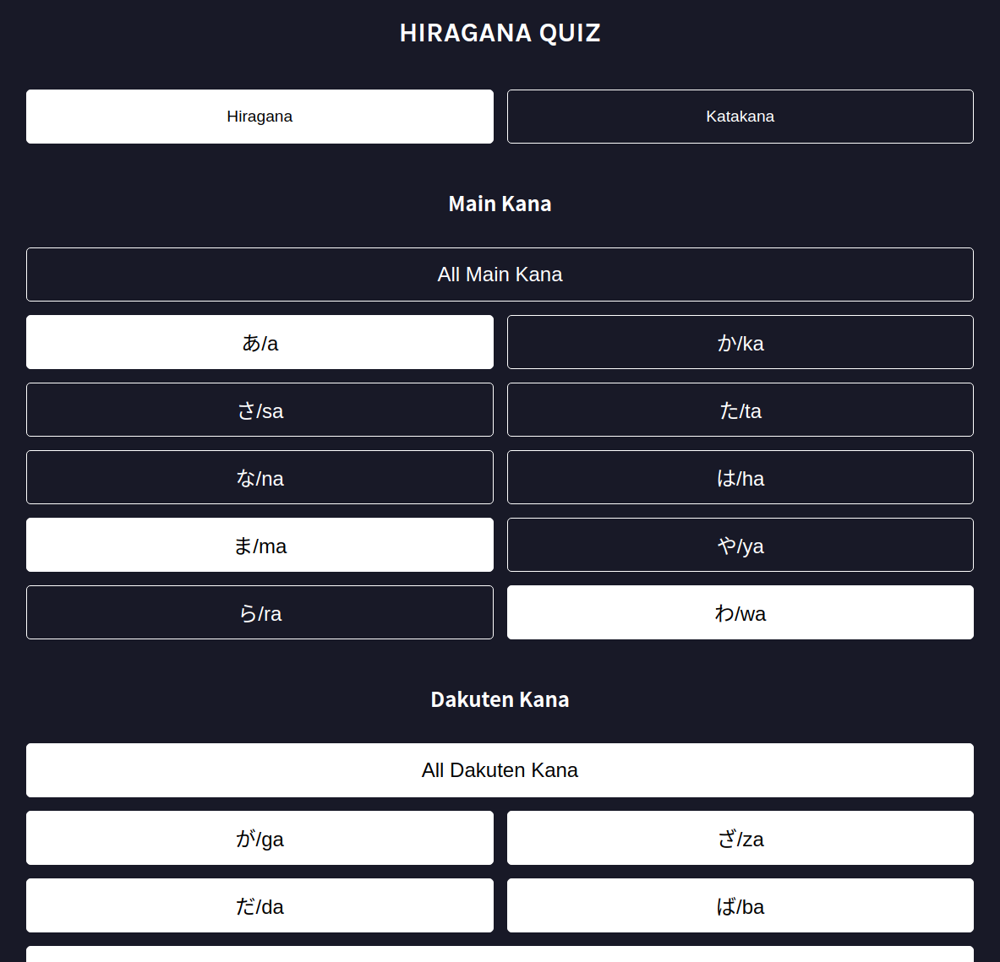
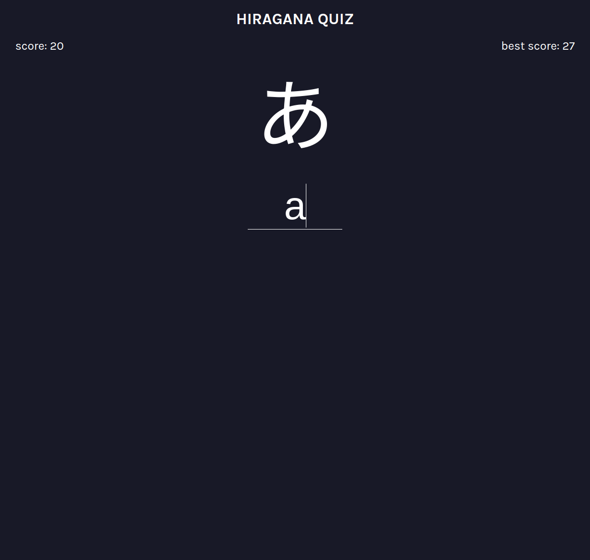
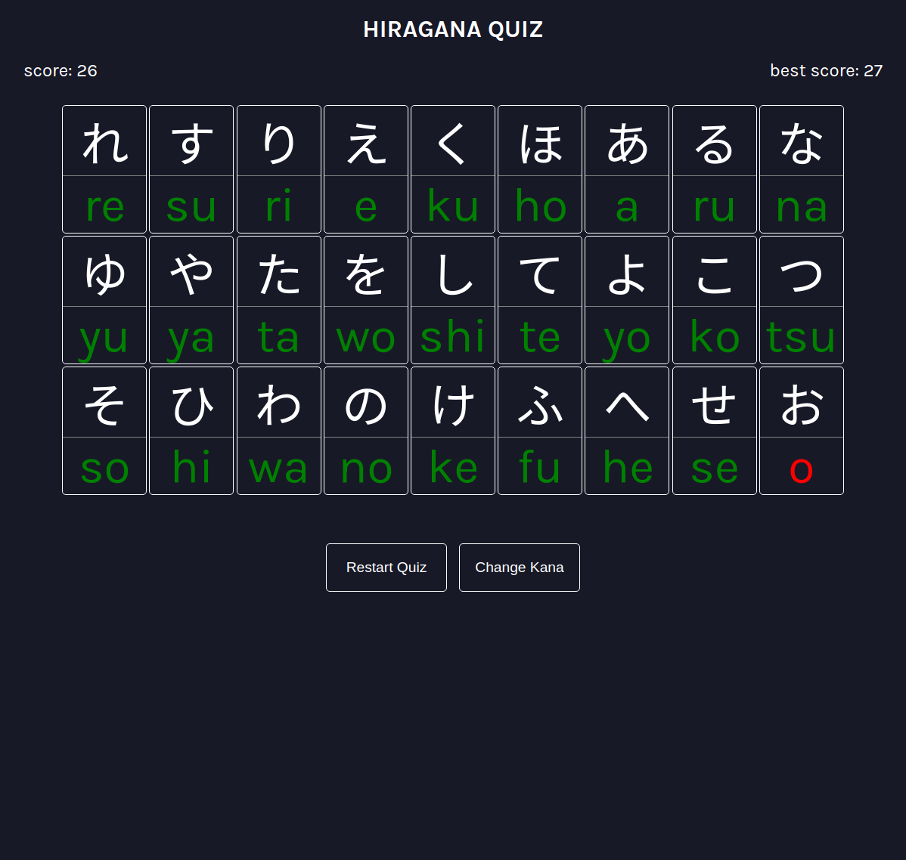
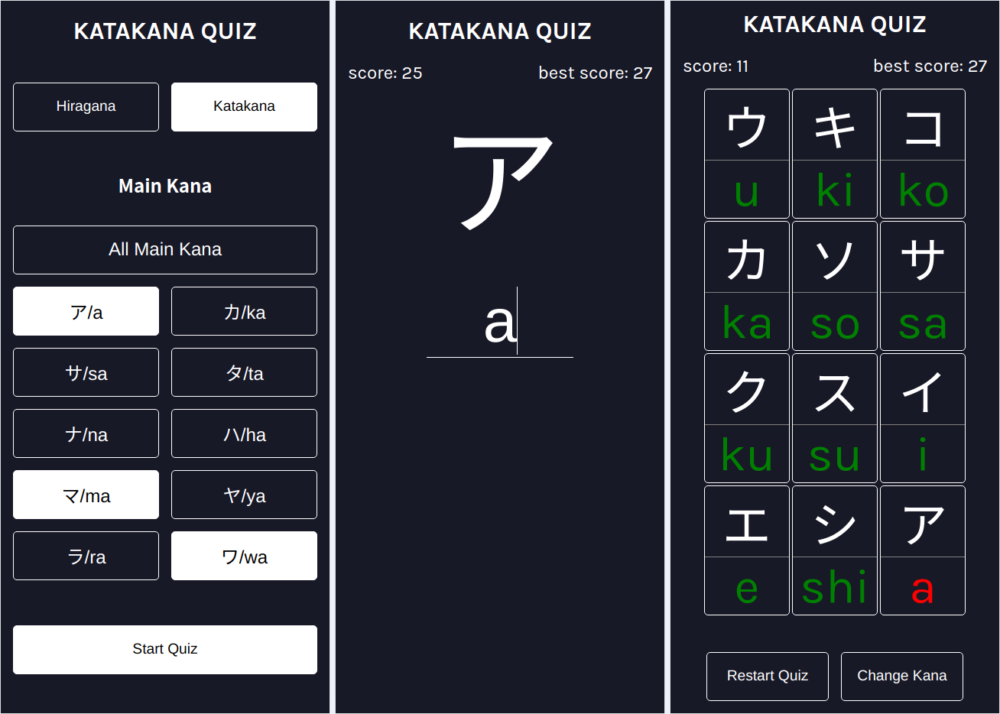

# React Project: Hiragana & Katakana Quiz

The goal of this project was to create a Japanese language learning app for practicing Hiragana and Katakana characters. The user can choose which groups of characters they want to practice. After starting the quiz the selected characters get shuffled and the user has to type the answer in romaji in the text field and press Enter. The quiz will keep track of the user's score and continue until the user answers incorrectly. Afterwards the user will be shown the characters they got right and wrong. The user can restart the quiz or return to the main page to select a new set of characters to practice.

Partially inspired by https://kana-quiz.tofugu.com/ however the quiz itself functions differently. 

I started and finished this project in July 2024.

## Technology

- React
- React Router v6
- JavaScript
- CSS
- Vite

## Key Concepts

- Client-side routing
- BrowserRouter & Routes: createBrowserRouter(), createRoutesFromElements() & RouterProvider
- Route, path & element
- Layout Route & Outlet
- Link: navigation
- useState & useEffect
- Context: useContext, createContext, context provider, passing values
- Local Storage: remembering the best score
- Arrays: getting unique values, filtering an array with another array

## Links

[Live Demo](https://bn7631-hiragana-katakana-quiz.pages.dev)

## Screenshots

### Desktop









### Mobile



## Sources

- https://fonts.google.com/specimen/Karla
- https://fonts.google.com/noto/specimen/Noto+Sans+JP

## Deployment

```bash
# clone repo
git clone https://github.com/BrightNeon7631/hiragana-katakana-quiz.git

# install project dependencies
npm install

# run vite dev server
npm run dev

# create a production build
npm run build
```